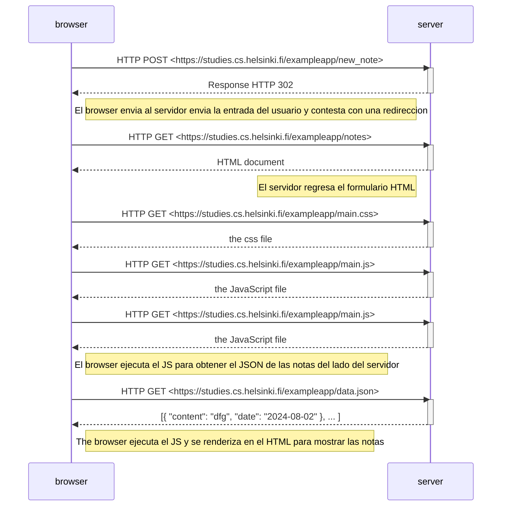

# Ejercicio 0.4: Nuevo diagrama de nota

Ejercicio 0.4 donde se establece un diagrama donde se muestre el comportamiento del navegador y el servidor cuando
el usuario envía una nota a través de la app de Notas.

