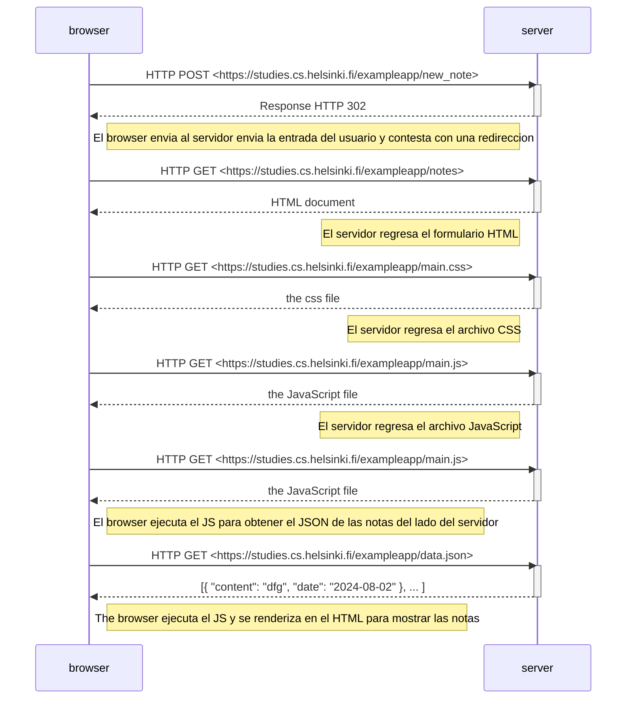
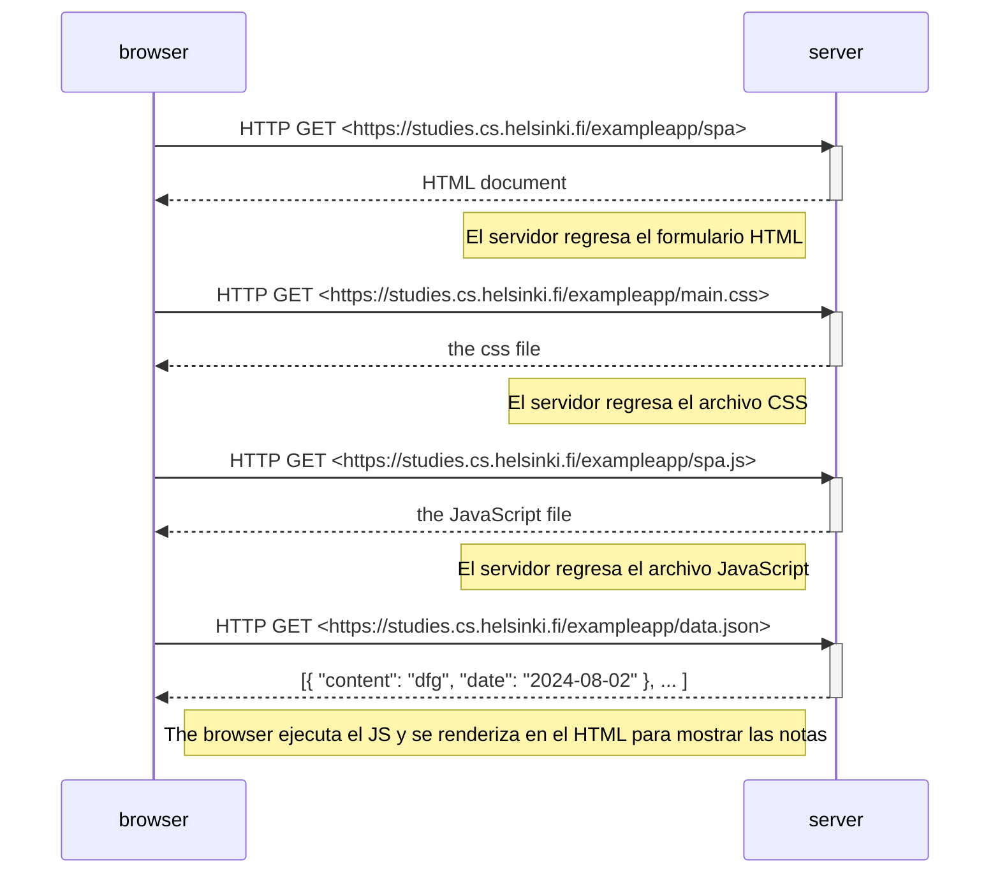
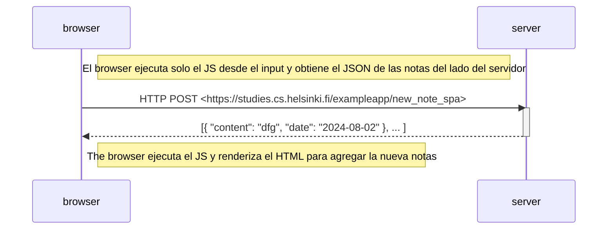

# Ejercicio 0.4: Nuevo diagrama de nota

Ejercicio 0.4 donde se establece un diagrama donde se muestre el comportamiento del navegador y el servidor cuando
el usuario envía una nota a través de la app de Notas.

# Ejercicio 0.5: Diagrama de aplicación de una sola página

Ejercicio 0.5 donde se establece un diagrama donde se muestre el comportamiento del navegador y el servidor cuando
el usuario abre la app de una sola página, que en mi opinión no camia en nada del anterior ejercicio.

# Ejercicio 0.6: Nueva nota en diagrama de aplicación de una sola pagina

Ejercicio 0.6 donde se establece un diagrama donde se muestre el comportamiento del navegador y el servidor cuando
el usuario inserta una nueva nota, aqui según el seguimiento por Network solo se envía.

